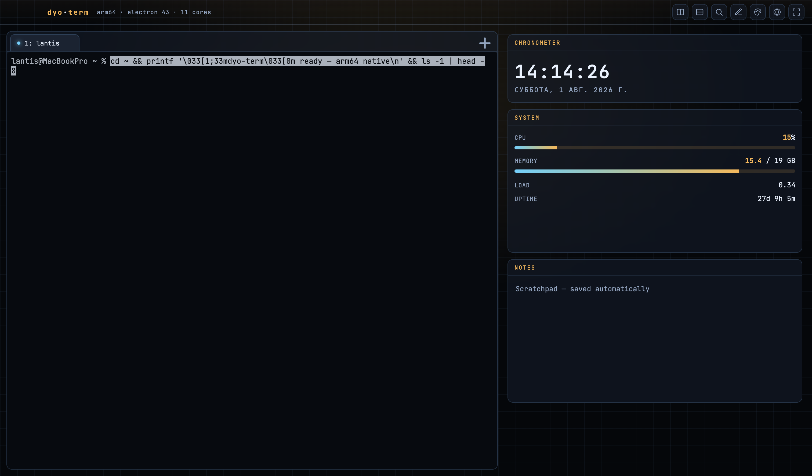

# dyo-term for windows

The Windows edition of **dyo-term** — a configurable, widget-driven sci-fi
terminal. Same app as the [macOS version](https://github.com/lanteim/dyo-term):
unlimited tabs, iTerm-style split panes, and a drag-and-resize widget dashboard
with **350+ widgets across 27 categories** (system, Kubernetes, Docker, cloud,
git, databases, web/API tools, security, observability, dev utilities, and
more), a theme gallery, and English/Russian language packs.

New in 0.3.0: an **A.Petrov-style monitoring** suite on the **APWidget**
framework — CPU / Memory / Disk / Network / System / Services / Logs / Docker /
Kubernetes / Ceph / Proxmox and PostgreSQL / ClickHouse / MySQL / InfluxDB /
Redis panels with per-widget refresh, a 1m/5m/15m/1h history graph + CSV export,
per-widget settings, a standard header (refresh · settings · collapse · close ·
last-updated), plus **4-side dashboard docking** and **layout profiles**.
Linux-host widgets (systemd, journalctl, Ceph, Proxmox) activate on the right
host and degrade cleanly elsewhere.

Built from scratch, MIT-licensed. Reuses only permissively-licensed libraries;
no GPL code.



## Windows specifics

The codebase is cross-platform (`src/main/platform.js`):

- **Shell** — defaults to PowerShell 7 (`pwsh.exe`) if installed, else Windows
  PowerShell, else `cmd.exe`.
- **Window chrome** — a native framed window with standard min/max/close.
- **Menu / clipboard** — copy/paste use `Ctrl+Shift+C` / `Ctrl+Shift+V`, so
  `Ctrl+C` stays SIGINT in the shell.
- macOS-only widgets (Apple Music, `scutil`, `pmset`, `brew`, …) show a friendly
  "macOS only" state; the other 340+ widgets work the same everywhere.
- Linux-host monitoring widgets (systemd services, journalctl logs, Ceph,
  Proxmox) show a "not available on this host" state on Windows and light up when
  the matching CLI is present.

## Install

Download the installer from
[Releases](https://github.com/lanteim/dyo-term-for-windows/releases) (built by CI
on `windows-latest`). It's not code-signed, so Windows SmartScreen may warn on
first run — choose **More info → Run anyway**.

## Build from source

Requires **Node.js ≥ 20** and the **Visual Studio Build Tools** (Desktop
development with C++) to compile the native `node-pty` module.

```powershell
npm install
npm start          # run
npm run build      # dist\dyo-term-Windows-x64.exe (nsis) + portable
```

CI (`.github/workflows/build.yml`) builds the installer on every push to `main`.
See `WINDOWS.md` for details.

## Keyboard shortcuts

| Action | Shortcut |
|---|---|
| New tab | `Ctrl+T` |
| Jump to tab | `Ctrl+1`–`Ctrl+9` |
| Split vertical / horizontal | `Ctrl+D` / `Ctrl+Shift+D` |
| Close pane | `Ctrl+W` |
| Find | `Ctrl+F` |
| Edit widgets | `Ctrl+E` |
| Theme gallery | `Ctrl+K` |

## License

MIT © lantis. Bundled fonts (JetBrains Mono, Fira Code) are under the SIL Open
Font License 1.1. Third-party libraries retain their own permissive licenses.
